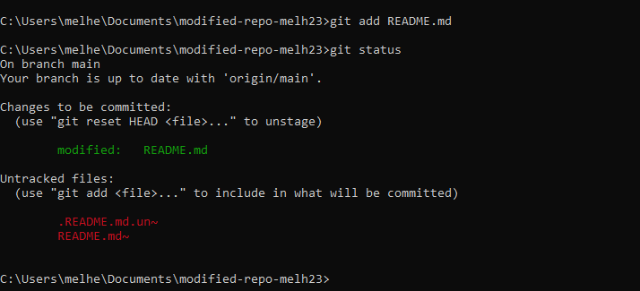
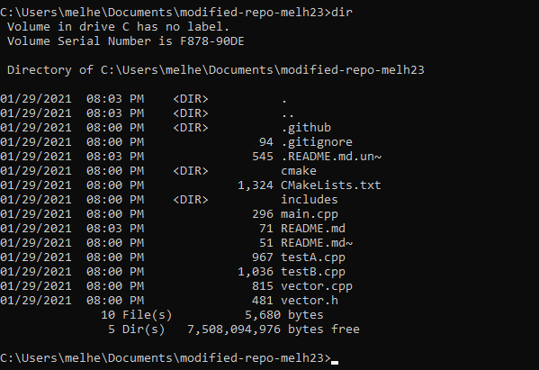
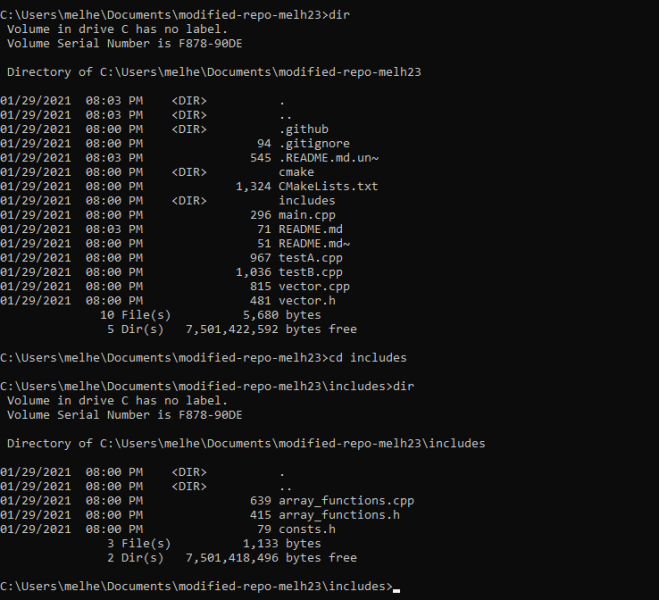

# Git commands:

### `git clone`:

Downloads the files in your github repository onto your local machine

**`git clone <repo link>`** will create a folder that is named after the repo in your directory and put all the files from online into it.

### `git status`:

Shows which files git is tracking and which files have been added to a commit
**git status**

This is how it will look if you haven't edited any files

This is how it will look if you have edited files, but not added them

This is how it woll look when you have added a change

### `git add`:

Adds selected files to be committed.

**`git add <filename>`** adds the specified file to be committed. Note: You do not need to write the <> when using this command, just the filename
**`git add .`** adds all uncommitted files to the commit
**`git add \*.cpp`** adds all files of type cpp to be committed

### `git commit`:

“Saves” the current state of all the added files in your local repository. Only files added at the time this command is run will be “saved”

**`git commit -m “comment”`** creates a commit with a descriptive comment or message. It is a good idea to explain what you’ve accomplished when committing. An example of a good comment would be: “Implemented string class”

**`git commit`** creates a commit without a comment. Your command prompt may open up a text editor like vim or emacs for you to leave a commit message. If you are not familiar with command line text editors, this can be confusing. To exit out of vim press **esc**, and enter **`:!q` (and enter)** to exit. To exit out of emacs, press **ctrl+x** then **ctrl+c**.

### `git push`:

Uploads all your local repo commits to the github website. Even if you have committed work, it will not be available on github until you push it. Note: Once a commit has been pushed to github, only the time/date it was committed will be shown, not the time/date it was pushed

**`git push`**

### `.gitignore`

There may be files you will never want to add to a commit. Like files generated by cmake or googletest when you build your project. You can tell git to ignore them by adding the names of those files (or directories) to a file named **`.gitignore`** in the highest level of your repository. There should be one file per line.

You can tell git to ignore certian types of files by adding **\*`.<filetype>`** as a line in your .gitignore.

# Filesystem standards:

Using the command prompt/terminal is similar to travelling through your filesystem in the normal File Explorer or Finder. When you first open your terminal, you will be in the home directory. This is usually your user folder (contains Documents, Desktop, etc.). From there you can travel to different folders within the file system.

When traversing your file system from the command line, there are certain shortcuts and commands that are good to know.

### `ls/dir`:

**`ls/dir`** shows the folders and files in your current directory. ls is used on Linux and Mac, and dir is for Windows.

**`ls/dir -a`** will show hidden files in the directory

### `cd`:

Stands for “change directory”. This is how to move between different folders in the command line. This only works for folders. You cannot open a .txt file or any other type of file with cd.

From your home directory you may want to do **`cd Documents`** to move to your Documents folder.

You don’t have to travel from one folder to another by moving one level at a time. cd will take you to the end of a path that you give it.

Let’s say your project folder called pointers is in Documents/cs3/ch2. You can get there quickly by entering **`cd Documents/cs3/ch2/pointers`** into the terminal.

**`cd ..`** will take you up a level from your current position in the file structure. From the previous example, you would use this if you are in your ch2 file and want to move to cs3.

**`cd`** without a path will take you back to your home directory on Linux/Mac, and will print your current path on Windows
